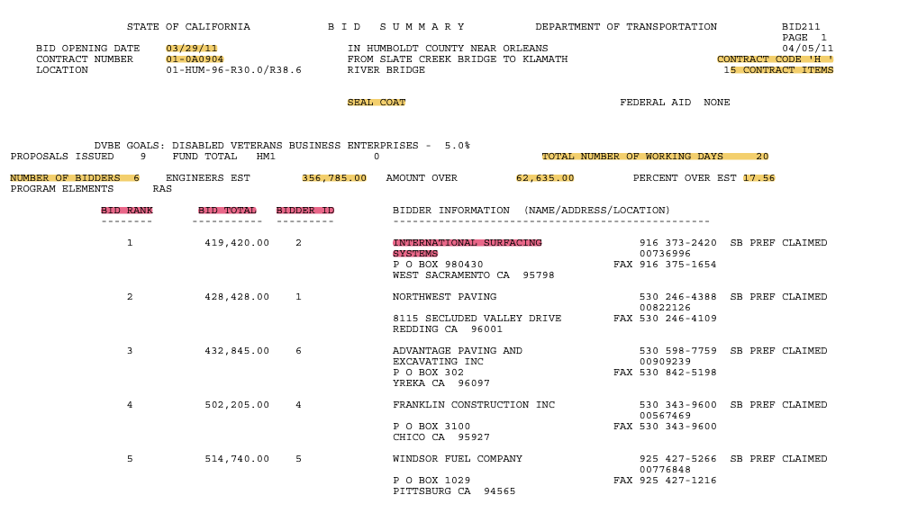
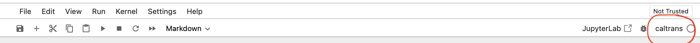

# Data Extraction using regex
"I learned more about `regex` that I probably wanted to know"

The goal of the project was to extract all sorts of data from 11'000+ pdf files that contain California Transportation contracts, available publicly, as part of a large research project. Considering well structured text the first decision was to extract data using [Regural expressions i.e. regex](https://en.wikipedia.org/wiki/Regular_expression), 
and I relied heavily on [regex101.com](https://regex101.com) for prototyping. Initial EDA showed that there were dozens of formatting variations and final logic was a mix of regex and Python as regex alone was not able to cover
all the use cases. I learned more about `regex` that I probably wanted to know, and realized its power and limitations.

One of 100K+ pages to extract:


Example of extracted data:


## Colab

Follow this <a href="https://colab.research.google.com/github/nesaboz/caltrans_data_extraction/blob/main/main.ipynb" target="_blank">link</a> to run the main.ipynb in Google Colab.

## Local (quick install)

1) Get raw_data.zip and sorted_data.zip from [Google Drive](https://drive.google.com/file/d/1y-ufhK56J3h994I5HKiarcFzbCkB6h_h/view?usp=share_link)

2) Unzip and make sure the structure is as follows:
```text
- raw_data
    - lineprinter
    - table
    - doc
```
3) Follow main.ipynb to set up the environment.

## Local (detailed setup)

1) Make sure Python 3.11.4 is installed on the system you are using (likely anything 3.8+ will do it but still 3.11.4 will work for sure).

2) [Clone](https://docs.github.com/en/repositories/creating-and-managing-repositories/cloning-a-repository) git repository (you will need access since this is a private repository), the link to the repository is:
`https://github.com/nesaboz/caltrans_data_extraction`

3) (optional) create a virtual environment or conda environment:
```bash
<path_to_python> -m venv <env_name>
source <env_name>/bin/activate
```

4) Run the following command in the terminal/cmd to install required packages:
```bash
pip install pandas==2.2.1 numpy==1.26.4 tqdm==4.66.2 ipykernel==6.29.3 notebook==7.1.1 openpyxl==3.1.2 pytest==8.1.1 pyperclip==1.8.2
```
or, install the libraries using the requirements.txt file:
```bash
pip install -r requirements.txt
```

5) Add jupyter kernel to the virtual environment:
```bash 
python -m ipykernel install --user --name=<env_name>
```

6) Open jupyter notebook in your IDE (like VSCode) or run `jupyter notebook` in terminal.

7) Set up kernel to the one you just created in the previous step.


