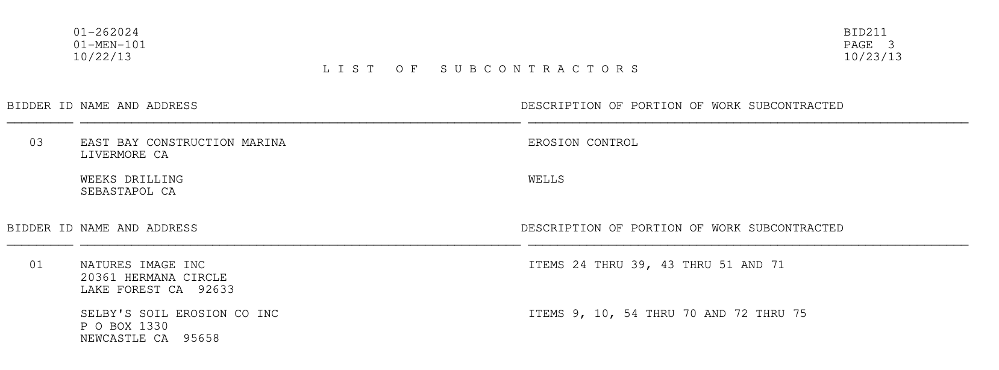

# Data Extraction from Contracts

We extract data from 11'000 PDF contracts available publicly for the purposes of research project. Considering well structured and high quality text, extraction was done using regex library in Python. 


## Prerequisites

### Linux/MacOSX

Install an environment with Python 3.6 or higher using bash commands:

```bash
virtualenv env_name_of_choice
source env_name_of_choice/bin/activate
```
then install the following libraries:
```bash
pip install pandas
pip install tqdm
pip install ipykernel
pip install notebook
```
or alternatively, you can install the libraries using the requirements.txt file:

```bash
pip install -r requirements.txt
```

You are now ready to run main.ipynb notebook.

## Questions

- contract number is not unique identifier (tag in the filename or date might be). Should we add date or tag to the bid_subcontractor, contract_bid, and line_item data? Examples of same contract numbers: 01-366004.pdf_12150, and 01-366004.pdf_12901, 01-364314.pdf_1094 and 01-362914.pdf_6320, etc.
- what OS will be used for evaluation?
- is UI needed
- what to do with A) and B), and A) + B)
- how to handle AMOUNT_ABOVE_UNDER, convert UNDER to be negative?
- some fields have quotes, for example: "TRUESDELL CORPORATION OF CALIFORNIA, INC." and STEWART ENGINEERING INC, does it need to be standardized?


## TODO 
Have to handle following bid items: 

