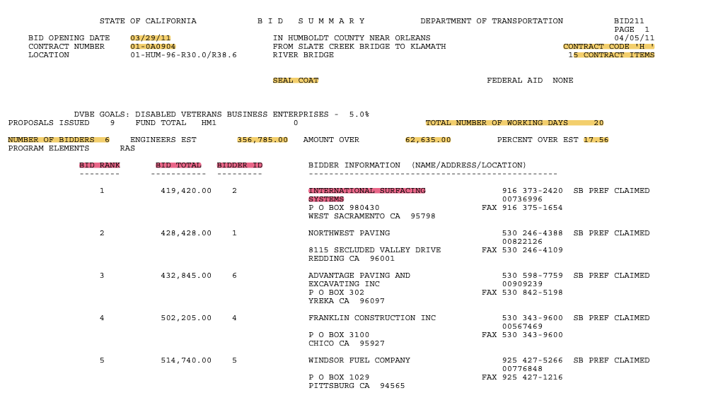

# Data Extraction from Contracts

We extract data from 11'000 PDF contracts available publicly for the purposes of research project. Considering well structured and high quality text, extraction was done using regex library in Python. 



## Prerequisites

### Linux/MacOSX

Install an environment with Python 3.6 or higher using bash commands:

```bash
virtualenv env_name_of_choice
source env_name_of_choice/bin/activate
```
then install the following libraries:
```bash
pip install pandas
pip install tqdm
pip install ipykernel
```
or alternatively, you can install the libraries using the requirements.txt file:

```bash
pip install -r requirements.txt
```

To deactivate the environment, run:

```bash
deactivate
```
